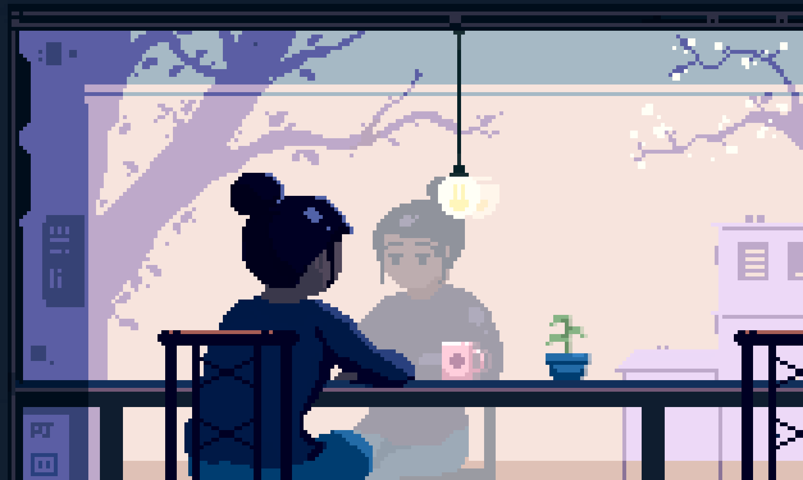

##  console.log("Hello, World!"); 

  Cientista da Computação em formação, determinada a transformar tecnologia em impacto social.  
 Dedico-me a criar soluções práticas com base em <strong>Ciência de Dados, Inteligência Artificial e Web</strong>, sempre com o propósito de inspirar e apoiar outras pessoas, especialmente meninas na tecnologia. ❤️

### Sobre mim:
> * 📚 Estudante de Ciência da Computação | Apaixonada por tecnologia e inovação
> * 💡 Explorando **Java | Python**
> * 🎓 Pesquisadora | Meninas STEM
> * 📫 Contato: **(98) 98 439-2704**.

 

<picture>
  <source media="(prefers-color-scheme: dark)" srcset="https://raw.githubusercontent.com/yasmimcosm/yasmimcosm/output/pacman-contribution-graph-dark.svg">
  <source media="(prefers-color-scheme: light)" srcset="https://raw.githubusercontent.com/yasmimcosm/yasmimcosm/output/pacman-contribution-graph.svg">
  
</picture>

#

 

 
 Sou formada como <strong>Técnica em Administração</strong> pelo IFMA e atualmente curso o <strong>2º período de Ciência da Computação</strong> na UFPI.   
Tenho focado meus estudos em <strong>Python</strong>, <strong>C</strong> e <strong>JavaScript</strong>, explorando áreas como <strong>Ciência de Dados</strong>, <strong>Inteligência Artificial</strong> e <strong>Desenvolvimento Web</strong>. Estou me aprofundando em conceitos como <strong>Programação Orientada a Objetos</strong>, <strong>Estrutura de Dados</strong>, <strong>Matemática Discreta</strong> e <strong>Cálculo</strong>, além de aprender <strong>HTML</strong>, <strong>CSS</strong> e <strong>Front-end</strong>.  
Programar é minha forma de transformar o mundo.
Não sou espectadora do futuro, sou autora dele. ✊💻 

Acredito em conexões que somam e transformam.
Me chama no LinkedIn, no Insta ou por e-mail — vou adorar trocar com você!  💌✨

  
  
  

<h3 align="left"> 💻 My Stack ~</h3>

  
  
  
  
  
  
  
  

  
  
## ⭐ GitHub Stats
<a href="https://github.com/eduardavieira-dev">
  
  
  
